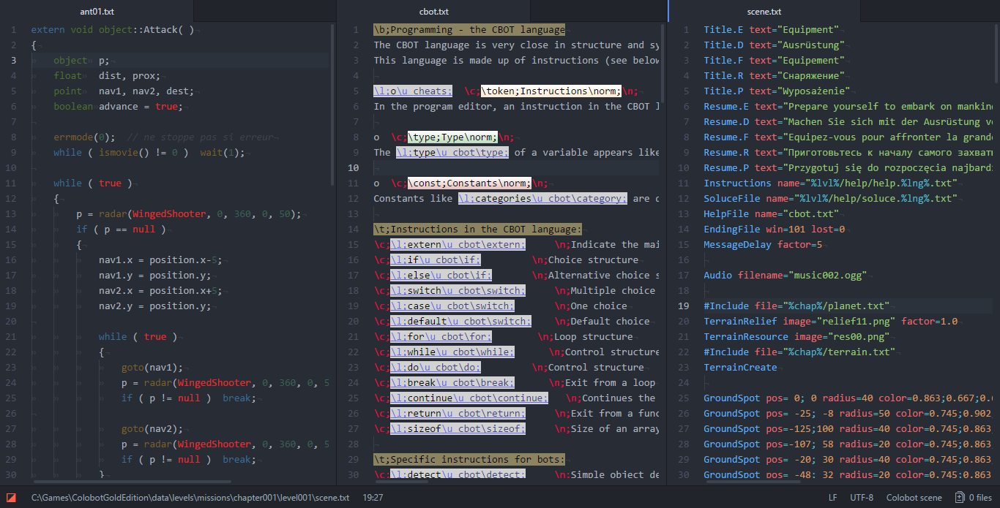

# colobot-development-pack

[Atom](http://atom.io) package for Colobot developers and modders. See http://colobot.info for more info.

# Current features

* Syntax highlighting for CBOT source code
* Syntax highlighting for Colobot scene files
* Syntax highlighting for SatCom files
* Syntax theme for CBOT source code
* Syntax theme for SatCom files
* Auto-detection based on unofficial (yet) file extensions (`cbot`, `satcom`, `scene`)
* Automatically set correct indentation settings for CBOT and SatCom files

# Ideas

They may be or not be implemented in the future.

* SatCom preview
* CBOT compiling
* Special syntax and/or UI theme

# Bugs and feature requests

View and/or create [issues](https://github.com/MrSimbax/colobot-development-pack/issues) on GitHub.
